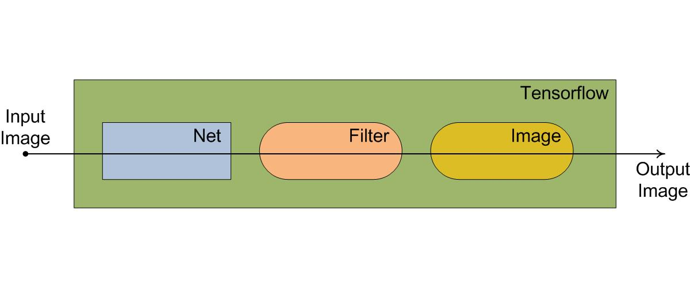
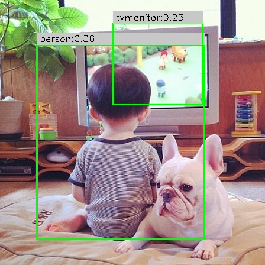
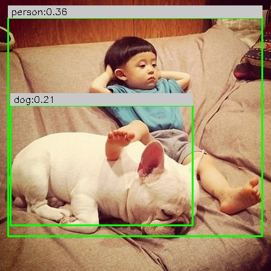

## Yolo_tensorflow
 - __Minimalism__
 - __Clean Code__
 - __Clear Structure__
 
## Dataflow

## Results
 &#8194; 

 &#8194; 

## See Also
 - [https://github.com/gliese581gg/YOLO_tensorflow](https://github.com/gliese581gg/YOLO_tensorflow)
